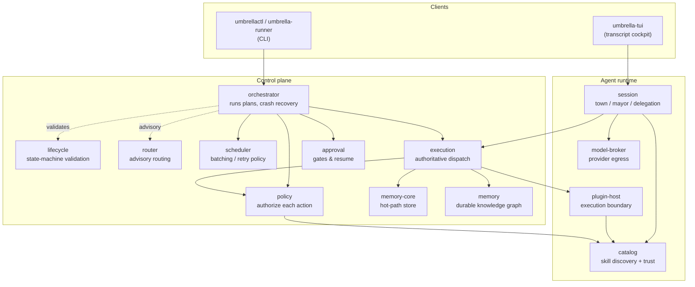
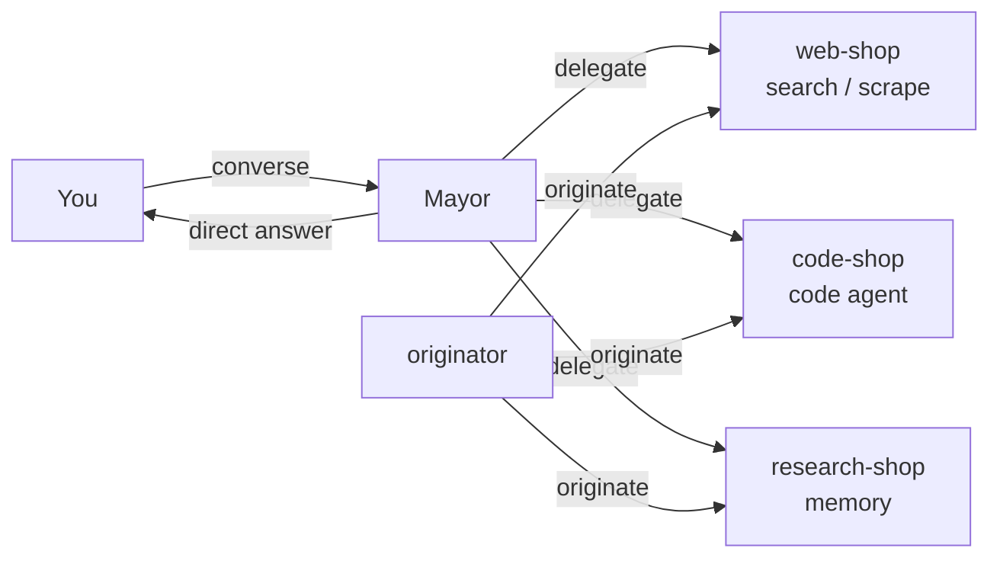
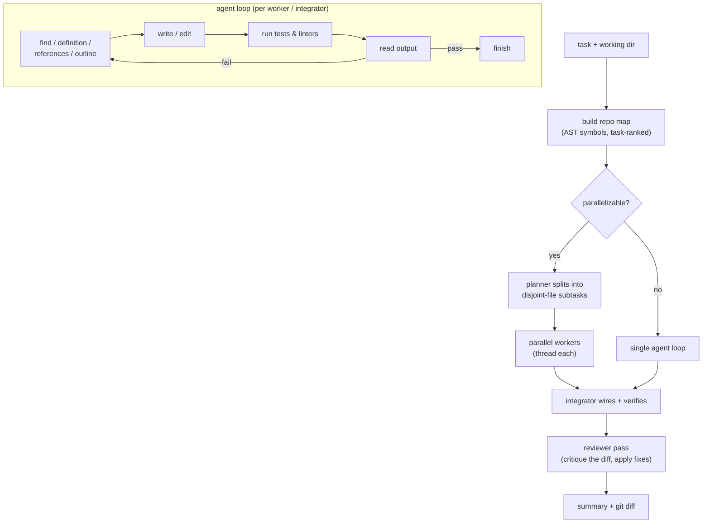
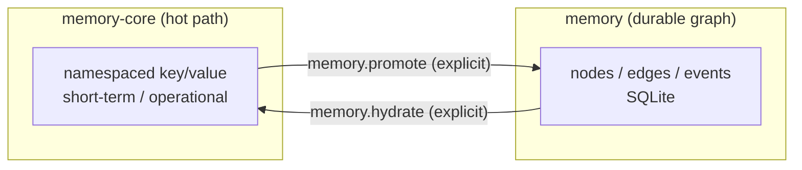

# Umbrella Architecture

Umbrella is a **local, single-host control plane for AI agents** plus an
**Umbrella-native agent runtime**. You talk to a "town" of agents from a
terminal; a coordinating *mayor* delegates real work to specialist worker
shops (web search, a codebase-aware coding agent, memory), and **every action is
authorized by policy, gated by approval, validated against a state machine, and
recorded in a two-layer memory system** — all on your own machine, with zero
third-party runtime dependencies.

This document is the mental model: what the pieces are, how a request flows
through them, and why the notable decisions were made.

---

## Design principles

1. **Governance-first.** "What is allowed to run, on which path, with what
   approvals" is a first-class, enforced concern — not a bolt-on. It's the spine
   of the system, not a middleware afterthought.
2. **Local-first, single-host.** Everything runs as localhost services on your
   machine. No cloud control plane, no multi-tenant assumptions.
3. **Zero runtime dependencies.** Every service is standard-library Python on
   `http.server`. `git clone` + `./install.sh` and it runs — nothing to pip, no
   database to provision. (The only external call is to a model provider.)
4. **Honest about itself.** Docs match the code, limitations are stated plainly,
   and a 40-test contract gate plus a pattern-verifier keep it that way.

---

## System topology

Two tiers: a **control plane** that governs and runs work, and an **agent
runtime** that hosts the town, skills, and execution. Each box is a single
stdlib `ThreadingHTTPServer` bound to `127.0.0.1` on an ephemeral port, tracked
in a manifest, authenticated with a shared mesh token.



| Service | Role |
|---|---|
| **policy** | Per-action authorization: capability claims, agent registration, identity scope, approval mode, memory-boundary guards, fs/network hints. Holds the runtime **autonomy toggle**. |
| **lifecycle** | Defines the run state machine and validates terminal reasons. |
| **router** | Advisory routing/capability metadata (execution is the authoritative resolver). |
| **scheduler** | Next-batch selection and the retry policy config. |
| **execution** | The dispatch hub: authorizes each step via policy, then routes it to `native` or `umbrella-agent-runtime`. The single authoritative runtime resolver. |
| **orchestrator** | Executes a plan step-by-step with per-transition state flushing, crash reconciliation, bounded retry, and wall-clock budgets. |
| **approval** | Records approval artifacts and drives approve/deny/resume. |
| **memory-core** | Short-term hot-path store (namespaced key/value, atomic + cross-process locked). |
| **memory** | Durable node/edge/event knowledge graph (SQLite, with a promotion queue/DLQ). |
| **session** | The town: sessions, mayor/originator agents, worker shops, sub-agents, `converse`, and delegation. |
| **catalog** | Discovers skills/plugins, enforces the trust model (signature/checksum, trusted scan roots). |
| **plugin-host** | Runs a skill/plugin as a subprocess — the execution boundary for the runtime. |
| **model-broker** | The single egress to the model provider: connection config, retry on transient failures, and provenance metadata. |

---

## Dispatch model — two paths

Every action is classified by a **capability contract** into exactly one path:

- **`native`** — first-party platform and memory-boundary actions
  (`memoryWrite/Read/Delete/List`, `memory.promote`, `memory.hydrate`). Executed
  directly against the memory services.
- **`umbrella-agent-runtime`** — the native agent runtime: catalog-managed
  skills, plugin-host execution, sessions/shops/sub-agents, and server-side
  conversation.

A run is a plan of **steps**. A step is either an **action step** (goes through
the capability contract → policy → dispatch) or a **raw command step** (a
`command` field sent to `/v1/execution/submit-command`, run with `/bin/sh` — a
deliberate *trusted-operator escape hatch* that policy does **not** gate; see
Governance).

### A governed run, end to end

```mermaid
sequenceDiagram
    participant U as umbrellactl / runner
    participant O as orchestrator
    participant P as policy
    participant E as execution
    participant PH as plugin-host / native
    participant A as approval

    U->>O: start run (plan)
    O->>P: preflight (drift + capability parity)
    loop each step
        O->>P: authorize-step
        alt approval required (mode = ask)
            P-->>O: BLOCKED
            O->>A: record approval request
            Note over O,A: run pauses until approve → resume
        else allowed (or autonomy = auto)
            O->>E: dispatch step
            E->>P: authorize-step (defense in depth)
            E->>PH: run action (native memory / skill via plugin-host)
            PH-->>E: result
            E-->>O: result (+ failure taxonomy)
        end
        O->>O: flush run.json atomically; validate transition
    end
    O-->>U: summary (SUCCEEDED / FAILED / BLOCKED)
```

The orchestrator flushes run state on **every** transition and, on startup,
reconciles any run left `RUNNING` by a crashed process to `FAILED` — so a run is
never silently stuck. Retry and wall-clock budgets are honored per the
scheduler/step policy.

---

## The town model

The native session model is town-shaped:

- The **mayor** is your first contact and runs `town-hall`.
- The **originator** runs `originator-studio` and can mint new worker shops.
- **Worker shops** each own a set of enabled actions (skills) and an agent.
- **Sub-agents** are runtime instances of workers inside a session.



**Delegation flow.** `POST /v1/sessions/{id}/converse` sends your message to the
mayor. The mayor (via the `chat.respond` skill and the model broker) returns
either a **direct** reply or a **delegate** decision with a *delegation plan*
(`shopId`, `actionId`, `inputs`). The session then runs that plan through
`orchestrate-turn` → `invoke-action` → execution.

Delegation is **asynchronous**: the mayor acknowledges immediately and the work
runs on a background thread; when it finishes, the result is posted back to the
session transcript. The **autonomy toggle** (`auto` / `ask`) decides whether
approval-gated actions (like code execution) run without prompting.

---

## The agent runtime

A skill is a directory under `skills/` with a `manifest.json` (id, runtime,
entrypoint, execution policy, and the `actions` it provides with input/output
schemas and policy hints) and an executable in `bin/`.

- **catalog** discovers skills from trusted scan roots, enforces the trust model
  (a file-drop in an untrusted location registers *disabled*; `require-signature`
  mode blocks unverified bundles), and exposes action metadata.
- **plugin-host** runs a skill as a subprocess with a scrubbed environment and a
  scratch working directory. It passes the invocation as JSON on stdin
  (`{invocation: {inputs, context}}`) and reads one JSON object from stdout.
- **session** binds skills into shops and drives conversation, delegation, turns,
  and sub-agents.

Shipped skills: `chat.respond` (the mayor's brain), the memory skills
(`get`/`search`/`link`/`summarize`), `web.search`/`web.fetch`,
`code.run`, `code.agent`, and `shop.originate`.

---

## The code agent (`skill.code.agent`)

The showpiece worker: a genuine autonomous coding agent, stdlib-only, that
navigates a codebase like an engineer, edits precisely, and verifies its own
work.



Key properties:

- **Codebase awareness.** Each run starts with a **repository map** — a
  task-ranked, symbol-level view built from the Python AST (functions, classes,
  methods) plus lightweight regexes for other languages, token-budgeted.
- **Editor-grade navigation.** `find` (VSCode-style: regex, whole-word, glob,
  context lines), `definition` (go to definition, backed by a cached symbol
  index), `references` (find all references), and `outline` (symbols in a file).
- **Verification in the loop.** It writes and runs tests/linters and iterates
  until they pass; it will not finish on unverified code.
- **Parallel workers.** A planner decomposes a large task into independent,
  disjoint-file subtasks; workers run the loop concurrently (model calls are
  I/O-bound), then an integrator reconciles and runs the full suite.
- **Context management.** A token-budgeted sliding window keeps the system prompt
  and task, retains recent turns verbatim, and compacts the middle into a
  progress note — so long runs stay within context.
- **Git-backed & reviewed.** Every run checkpoints in git (each change is a
  reviewable, revertible diff), and a final reviewer pass critiques the diff and
  applies fixes.

---

## Memory model

Two layers, crossed only by an explicit boundary:



- **memory-core** — fast operational state, flat JSON, atomic writes under a
  cross-process lock.
- **memory** — the durable knowledge graph (SQLite, schema-versioned migrations),
  with a promotion queue/DLQ that validates payloads, drains automatically, and
  parks poison entries rather than retrying forever.

Both memory layers start by default with `bringup` and are mesh-token
authenticated.

---

## Governance & security

The **policy engine** authorizes every action step across multiple dimensions:
capability claims, agent registration, identity scope (which shops/roles/agents
may run an action), approval mode, memory-boundary hot-path guards, and
fs/network hints. Approval-gated actions are governed by the runtime **autonomy
toggle**:

- **`ask`** — approval-required actions must be explicitly approved.
- **`auto`** (default) — those actions run without prompting (autonomous).

Mesh authentication: every service rejects unauthenticated requests in the
default bringup; the token compare is constant-time; secrets are written `0600`;
release builds refuse to package credentials.

**Honest limitation — the sandbox is honor-system.** Skills run as ordinary
local subprocesses; the `fs`/`network` isolation a manifest *declares* is not
enforced (a warning is emitted instead). Combined with `auto` + code execution,
that is powerful but sharp: anything reaching the mayor's chat can cause real
code to run on the host. This is acceptable for a single trusted operator on
their own machine; it is the thing to know before pointing the town at untrusted
input. Real container isolation is supported by plugin-host but not the default.

---

## State, persistence & resilience

All stateful services use a shared module (`services/persistence.py`) for
**atomic writes** (`tmp` + `fsync` + `os.replace`) and **cross-process file
locks**, combined with per-service in-process locks — so concurrent handlers
never lose writes (verified against an 8-process lost-update stress test). The
orchestrator adds per-transition run flushing and startup crash reconciliation.
Upgrades are non-destructive (durable state is excluded from the reinstall and
snapshotted first), with a `umbrella-backup` tool and schema-versioned DB
migrations.

---

## Entry points

| Command | Purpose |
|---|---|
| `umbrella-setup [--start]` | First-run wizard: configure a provider, optionally bring up the platform and open the TUI. |
| `umbrella-manage bringup / status / shutdown` | Service lifecycle. |
| `umbrella-tui` | The transcript-first cockpit: talk to the mayor, watch delegations, manage the stack. |
| `umbrellactl` | CLI: run plans, check run status, memory operations. |
| `umbrella-runner` | Run a plan directly. |
| `umbrella-backup` | Snapshot/restore durable state. |

---

## Key design decisions & trade-offs

- **Governance-first, not agent-first.** Most agent frameworks treat "what is
  this allowed to do" as an afterthought. Umbrella makes per-action
  authorization, approval, and lifecycle validation the center. The cost is more
  moving parts; the benefit is that autonomy is governed by construction.
- **Zero runtime dependencies.** Choosing stdlib `http.server` over a web
  framework, flat-JSON + SQLite over a database, and an AST/regex repo-map over
  embeddings keeps install trivial and the whole system readable end-to-end. The
  ceiling is scale and cross-language semantic depth — deliberately traded away
  for ownership and portability.
- **Single-host.** No distributed execution or multi-tenancy. For one operator
  this is the right scope; it is not a horizontally-scalable platform, by design.
- **Execution as the single resolver.** The router is advisory; execution
  independently resolves the runtime, so there is one authoritative dispatch
  decision rather than two that can diverge.
- **Async delegation.** Conversation does not block on long work; results post
  back to the transcript. The trade-off is that interrupted background work does
  not yet self-reconcile.
- **Honor-system isolation.** Real sandboxing was deferred in favor of the
  approval gate as the primary control — a conscious choice for a personal,
  single-user tool, and the main thing to revisit before multi-user or
  untrusted-input use.

---

## Repository layout

```
services/            # every service: one app.py per service, stdlib only
  persistence.py     # shared atomic-write + cross-process lock helpers
  policy/ execution/ orchestrator/ ...   # control plane
  session/ catalog/ plugin_host/ model_broker/   # agent runtime
  memory/ memory-core/                    # memory layers
skills/              # native skills (chat, memory, web, code.run, code.agent, shop.originate)
control-plane/       # runtime config, plans, policy, state machine, capability contract
scripts/             # launchers, umbrellactl, tools (memory-core-reconcile, umbrella-backup, ...)
tests/contract/      # the 40-test contract gate
docs/                # user/operator + architecture docs
```

---

## Limitations

The honest current edges (see also [docs/KNOWN_LIMITATIONS.md](docs/KNOWN_LIMITATIONS.md)):

- Sandboxing is host-dependent (honor-system for shell/python runtimes).
- Interrupted async delegations do not self-reconcile yet.
- Durable-memory search is token-level BM25 ranking (multi-namespace), not
  embedding/semantic (an embeddings upgrade is roadmap).
- Service supervision is script-managed, not OS-native.
- Single-host; no distributed execution.

For the full completion plan and roadmap, see
[docs/COMPLETION_PLAN.md](docs/COMPLETION_PLAN.md).
